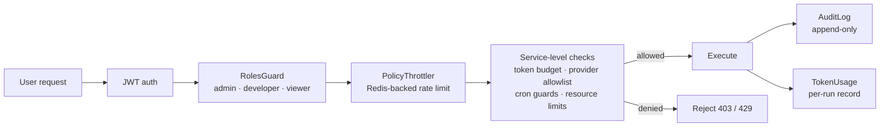

# Clawix — Governance & Audit

> How Clawix keeps AI usage under control: who can do what, how much it costs, and who is accountable.
> Items marked **[pending]** are on the roadmap but not yet live.

Governance in Clawix is built on two pillars:

1. **Policy** — a single record per user that defines quotas, permitted AI providers, and feature flags. Every enforcement decision traces back to this row.
2. **AuditLog** — an append-only table that records every mutating action with actor, resource, IP, and a before/after snapshot.

Together they ensure that limits are machine-enforced and that any breach is traceable.

---

## Enforcement architecture

Every user action passes through a layered guard chain before reaching business logic:

Enforcement is **layered** — a request blocked at `RolesGuard` never reaches budget checks, and one blocked by the token budget is still logged to `AuditLog`. No single layer is a single point of failure.

---

## Why this matters to the business

Without governance, a single misconfigured workflow can:

- exhaust the monthly AI budget in hours,
- invoke unapproved or uncontracted AI providers,
- spawn scheduled jobs that run indefinitely in the background,
- or perform privileged actions that cannot be attributed to an individual.

Clawix closes each of these gaps at the API layer — not by convention, but by guards and interceptors that run on every request.

---

## What is controlled

All limits are defined on the **Policy** — one record per user. Re-assigning a user to a different Policy is the only change needed to adjust their allowances.

| Area                       | How it works                                                                                                                                 | Business benefit                                                            |
| -------------------------- | -------------------------------------------------------------------------------------------------------------------------------------------- | --------------------------------------------------------------------------- |
| **Token budget**           | Rolling calendar-month spend tracked in `TokenUsage`; checked against `policy.maxTokenBudget` (USD) before each model call                   | Predictable, attributable AI cost per user                                  |
| **Resource limits**        | Hard caps on max agents, skills, memory items, and owned groups; enforced at the repository layer on every insert                            | Fair capacity allocation across teams                                       |
| **AI provider allowlist**  | `policy.allowedProviders` checked before any LLM dispatch; empty list inherits org-wide defaults                                             | Compliance with vendor contracts and data-handling rules                    |
| **Scheduled tasks (cron)** | Opt-in per Policy; enforces max active tasks, minimum recurrence interval, and per-run token cap; auto-disabled after 3 consecutive failures | Background automation cannot run silently out of control                    |
| **Role-based access**      | Three roles — `admin`, `developer`, `viewer` — declared with `@Roles()` on every controller method                                           | Least-privilege access; separation of oversight, build, and read-only usage |
| **API rate limiting**      | Per-user bucket in Redis; falls back to IP for unauthenticated traffic                                                                       | Platform stability under load; protects against runaway clients             |

---

## Accountability

All mutating HTTP actions (POST / PATCH / PUT / DELETE) are intercepted and written to the `AuditLog` automatically — no per-endpoint instrumentation required. High-cardinality endpoints (chat, token-usage streaming) are excluded to keep the log actionable.

| Field            | What it records                                                 |
| ---------------- | --------------------------------------------------------------- |
| Actor (`userId`) | The authenticated user who performed the action                 |
| Action           | Verb + resource type (e.g., `agents.create`, `policies.update`) |
| Resource + ID    | The entity that was affected                                    |
| Details          | Before/after snapshot of relevant fields                        |
| IP address       | As observed at the API gateway                                  |
| Timestamp        | Indexed; supports time-range queries                            |

**Access rules:**

- Admins query the full organizational trail, filterable by user, action, resource, and date range.
- Non-admins are silently scoped to `userId = self` at the service layer, regardless of query parameters.
- No `PATCH` or `DELETE` route exists for audit records. DB-level append-only enforcement via triggers is **[pending]**.

---

## Visibility

The web dashboard exposes governance data through dedicated views backed by REST endpoints:

- **Token usage** (`/governance/tokens`) — monthly spend per user and per model, with trend data
- **Agent activity** — active agents, run history, and status
- **Scheduled tasks** — current state, last-run timestamp, consecutive failure count
- **Audit log** (`/governance/audit`) — searchable event history, role-scoped

---

## Sub-agents

When an agent spawns helper sub-agents to parallelize work, each helper is bound to the same user's Policy. Token usage from all sub-agents is recorded under the originating user's ID and counts toward their monthly budget. Spawning 20 sub-agents divides the budget 20 ways — it does not multiply it. The provider allowlist and cron restrictions apply equally to sub-agents, closing the fan-out loophole common in multi-agent systems.

---

## Roadmap

| Item                                             | Status                                                        |
| ------------------------------------------------ | ------------------------------------------------------------- |
| Per-day and per-request token caps               | **[pending]** — today: monthly budget + per-cron-run cap only |
| Budget-threshold alerts (80 % / 100 %)           | **[pending]**                                                 |
| Per-policy rate-limit overrides                  | **[pending]** — today: org-wide static defaults               |
| Cryptographically signed / chained audit entries | **[pending]**                                                 |
| DB-level append-only enforcement (triggers)      | **[pending]**                                                 |
| Log retention and archival automation            | **[pending]**                                                 |
| Bulk policy reassignment in the admin console    | **[pending]**                                                 |
| Dashboard quota-approach warnings                | **[pending]**                                                 |

---

## Bottom line

Clawix provides **policy-driven, auditable, cost-aware** AI governance enforced at the API layer through a layered guard chain. The controls required for enterprise adoption are in place today; compliance-grade hardening — signed audit logs, DB-level immutability, retention automation, and proactive alerting — is the next milestone.
