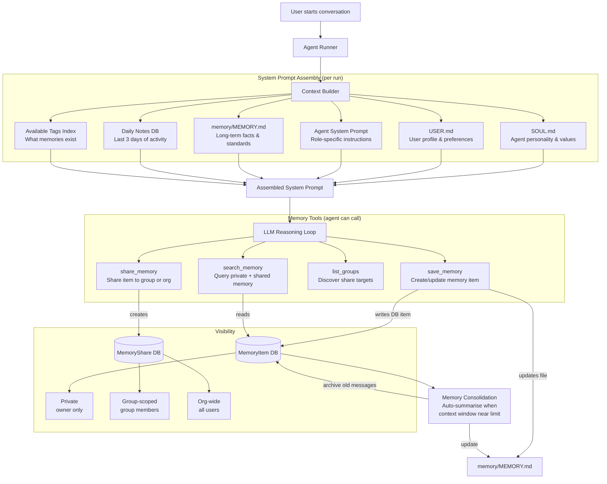
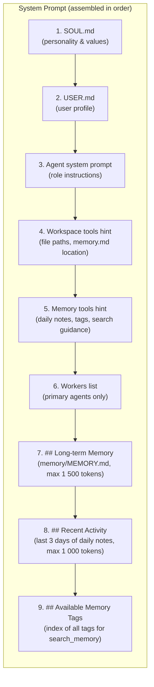
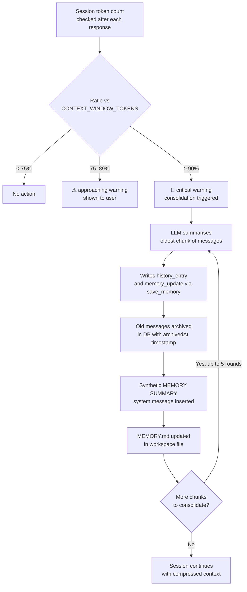
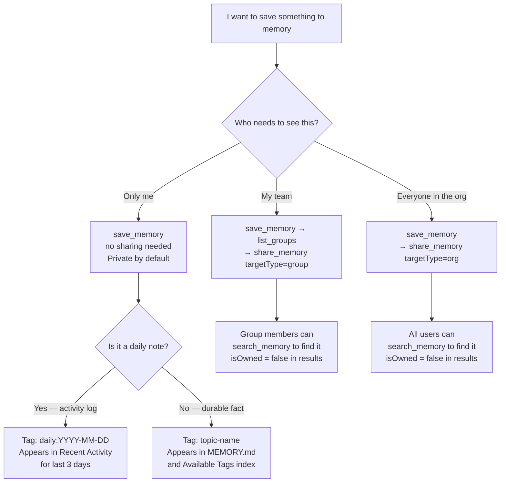

# Memory — Guide

## What is Memory?

In Clawix, **memory** is the collective term for all persistent context that is loaded into an agent's system prompt at the start of every run. It is what gives agents continuity — the ability to remember who you are, what you have worked on, what you have learned, and what you have decided — across separate conversations.

Memory is **not** a single monolithic file. It is a layered system with four distinct components, each serving a different purpose:

| Layer                                     | Source                               | What it contains                                              | Who controls it                |
| ----------------------------------------- | ------------------------------------ | ------------------------------------------------------------- | ------------------------------ |
| **Soul** (`SOUL.md`)                      | Static file in workspace             | Agent personality, communication style, values                | Admin / user (edit the file)   |
| **User Profile** (`USER.md`)              | Static file in workspace             | User name, preferences, work context, special instructions    | Agent learns + user edits      |
| **Long-term Memory** (`memory/MEMORY.md`) | Auto-maintained file                 | Durable facts, decisions, standards, accumulated knowledge    | Agent writes via `save_memory` |
| **Daily Notes**                           | Database (tagged `daily:YYYY-MM-DD`) | Short-term activity journal; what happened in the last 3 days | Agent writes via `save_memory` |

All four layers are injected into the agent's **system prompt** at the start of each run, before any conversation history. This means the agent always "wakes up" with full context — without the user needing to repeat themselves.

---

## Why Use Memory?

Without memory, every conversation with an agent starts from scratch. The agent forgets your name, your preferences, what you decided last week, and what it already tried. With memory:

- **No repetition** — You don't re-explain your stack, style preferences, or ongoing projects every session.
- **Compounding value** — The agent accumulates knowledge over time. The longer you work together, the more context-aware and accurate the responses become.
- **Continuity across agents** — When memory items are shared to a group or the org, sub-agents and other users can access the same knowledge base.
- **Self-improving prompts** — The agent updates `USER.md` and `MEMORY.md` as it learns, keeping its own context current.
- **Autonomous journaling** — Daily notes (`daily:YYYY-MM-DD` tags) give you and the agent a searchable activity log without manual effort.
- **Knowledge sharing** — Decisions, standards, and discoveries can be promoted from private memory to group or org-wide memory with a single `share_memory` call.

---

## Public vs Private Memory

Clawix implements a **three-tier visibility model** for database memory items. The tier is determined by whether a `MemoryShare` record exists and what its `targetType` is.

```
┌─────────────────────────────────────────────────────────────────────┐
│                         MEMORY VISIBILITY                           │
│                                                                     │
│  Private (default)       Group-scoped         Org-wide             │
│  ┌─────────────┐         ┌─────────────┐      ┌─────────────┐      │
│  │OwnerID only │         │ Group A     │      │ All users   │      │
│  │             │  share  │ members     │share │ in the org  │      │
│  │  MemoryItem │ ──────► │             │────► │             │      │
│  │  (no share) │         │ MemoryShare │      │ MemoryShare │      │
│  │             │         │ type=GROUP  │      │ type=ORG    │      │
│  └─────────────┘         └─────────────┘      └─────────────┘      │
│                                                                     │
│  Revocable: sharing can be revoked (isRevoked flag)                 │
└─────────────────────────────────────────────────────────────────────┘
```

### Private memory

A memory item with no associated `MemoryShare` record. Only the owning user (and their agents) can read it.

**Use for:** Personal preferences, private notes, individual coding standards, personal API keys or account references, draft ideas not ready to share.

### Group-scoped memory

A memory item shared to a named **Group** (`targetType = 'GROUP'`). All members of that group can search and read it. Only the original owner can revoke the share.

**Use for:** Team decisions, shared coding conventions, project knowledge, shared prompt templates, collaborative research findings.

### Org-wide memory

A memory item shared to the entire organisation (`targetType = 'ORG'`, no `groupId`). Every user in the deployment can read it.

**Use for:** Company-wide standards, approved tool lists, product descriptions, security policies, on-boarding information for new agents.

### Visibility resolution

When `search_memory` runs, it queries all three tiers simultaneously using this logic:

```
Visible = (owned by user)
        ∪ (shared to any group the user is a member of, not revoked)
        ∪ (shared to org, not revoked)
```

The `isOwned` flag in search results tells the agent whether it owns the item (and thus can share or update it).

---

## Memory Architecture — Full Flow



---

## The Workspace Memory Files

Navigate to **Workspace** in the left sidebar (path: `/workspace`).


The workspace root contains four items relevant to memory:

| Item         | Type   | Purpose                                                           |
| ------------ | ------ | ----------------------------------------------------------------- |
| `memory/`    | Folder | Contains `MEMORY.md` — the agent's long-term knowledge file       |
| `SOUL.md`    | File   | Agent personality bootstrap — injected before every system prompt |
| `USER.md`    | File   | User profile bootstrap — injected before every system prompt      |
| `projector/` | Folder | UI templates (unrelated to memory)                                |

### The `memory/` folder


The `memory/` folder contains a single file: **`MEMORY.md`**.


`MEMORY.md` is the agent's **long-term knowledge file**. It is:

- Written and updated by the agent using the `save_memory` tool
- Auto-generated on first run from existing DB memory items (excluding daily notes)
- Formatted as markdown with one section per tag
- Truncated to ~1 500 tokens when injected into context (approx. 6 000 characters)
- Editable by the user directly in the Workspace file browser

**Example structure of MEMORY.md:**

```markdown
# Memory

## Coding-standards

- Always use TypeScript strict mode. Prefer functional patterns over classes.

## Project-decisions

- Switched from REST to tRPC for the internal API on 2026-03-15.

## Team-preferences

- PRs must be reviewed by at least 2 engineers before merge.
```

### SOUL.md — Agent Personality


`SOUL.md` defines the agent's **character**. It is injected verbatim at the top of every system prompt. The default template sets personality, communication style, and values — but you can edit it to shape the agent's behaviour for your organisation.

**Default sections:**

- **Personality** — e.g., "Helpful and professional", "Concise and clear"
- **Communication Style** — e.g., "Adaptive to user preference", "Technical when appropriate"
- **Values** — e.g., "Accuracy over speed", "User privacy and safety"

Editing `SOUL.md` is the primary way to customise an agent's persona without touching the system prompt in the agent definition.

### USER.md — User Profile


`USER.md` is the user's **profile document**. It is templated with the user's name at workspace creation and is then progressively enriched by the agent as it learns preferences from conversation.

**Default sections:**

- **Basic Info** — Name, timezone, preferred language
- **Preferences** — Communication style, response length, technical level
- **Work Context** — Role, ongoing projects, tools used
- **Special Instructions** — User-specific overrides the agent should always follow

The agent can update `USER.md` directly using the `write` file tool when it learns something new and persistent about the user.

---

## Context Injection Order

Every agent run assembles the system prompt in this exact order:



> **Sub-agents** receive a simplified prompt: only the agent system prompt (sections 3–5). They do not receive `SOUL.md`, `USER.md`, or memory sections — their context is intentionally minimal and task-focused.

**Token budgets for context injection:**

| Section                   | Max tokens | Notes                                  |
| ------------------------- | ---------- | -------------------------------------- |
| `MEMORY.md`               | 1 500      | ~6 000 characters; truncated if longer |
| Daily notes (last 3 days) | 1 000      | Per-item truncation at 500 chars       |
| Tags index                | minimal    | Comma-separated list of tag names      |

---

## Memory Tools

Agents interact with the memory system using four tools. These tools are available to both primary agents and sub-agents.

### `save_memory` — Create or update a memory item

Stores a piece of knowledge in the database and updates `MEMORY.md`.

```
Input:
  content   (required)  — string or JSON object, max 2 000 chars
  tags      (optional)  — string array, max 10 tags, each max 50 chars
  memoryId  (optional)  — if provided, updates an existing item instead of creating new
```

**Examples the agent might call:**

```
save_memory(
  content = "The team decided to use Zod for all input validation — no manual if/else checks.",
  tags    = ["coding-standards", "validation"]
)

save_memory(
  content = "User prefers bullet-point responses over prose for technical topics.",
  tags    = ["user-preferences"]
)

save_memory(
  content = "Completed: refactored auth middleware to use JWT RS256. 2026-04-24.",
  tags    = ["daily:2026-04-24"]
)
```

> **Daily notes convention:** Tag with `daily:YYYY-MM-DD` to create activity journal entries. These are automatically included in the last-3-days context injection and excluded from `MEMORY.md`.

> **Quota:** Each user is subject to a `maxMemoryItems` limit set by their Policy (default: 1 000 items).

---

### `search_memory` — Query accessible memory

Searches all memory visible to the user (private + group-shared + org-shared) by text and/or tags.

```
Input (at least one required):
  query   (optional)  — case-insensitive substring search on content text
  tags    (optional)  — AND logic: all specified tags must be present on the item
```

Returns up to **20 results**, each with `memoryId`, `content`, `tags`, `createdAt`, and `isOwned`.

**Examples:**

```
search_memory(query = "auth middleware")
search_memory(tags  = ["coding-standards"])
search_memory(query = "Zod", tags = ["validation"])
search_memory(tags  = ["daily:2026-04-23"])  ← retrieve yesterday's notes
```

---

### `list_groups` — Discover share targets

Returns all groups the user belongs to, plus a synthetic `org` entry for org-wide sharing.

```
Output:
  [{ groupId, name, type: 'group'|'org', role: 'OWNER'|'MEMBER' }, ...]
```

The agent should call `list_groups` before calling `share_memory` to resolve valid `groupId` values.

---

### `share_memory` — Promote a private item to group or org

Shares an owned memory item with a group or the whole organisation.

```
Input:
  memoryId    (required)              — ID of the memory item to share
  targetType  (required)              — 'group' or 'org'
  groupId     (required if 'group')   — ID from list_groups output
```

Sharing is **idempotent** — calling `share_memory` on an already-shared item returns the existing share. Shares can be revoked, but only via the API (no UI revocation yet).

**Example workflow — promoting a coding standard to the team:**

```
1. save_memory(content="Use pnpm, never npm or yarn.", tags=["tooling"])
   → returns memoryId = "clx1234"

2. list_groups()
   → returns [{ groupId: "grp_eng", name: "Engineering", type: "group", role: "MEMBER" }]

3. share_memory(memoryId="clx1234", targetType="group", groupId="grp_eng")
   → "Engineering" team members can now search and read this item
```

---

## Memory Consolidation (Automatic)

When a conversation session grows large enough to approach the **context window limit** (default: 65 536 tokens), Clawix automatically runs **memory consolidation**.



**Key facts about consolidation:**

- Performed by a separate LLM call using `CONSOLIDATION_MODEL` (default: `gpt-4o-mini`)
- Up to **5 consolidation rounds** per session
- Archived messages remain in the database — they are soft-deleted, not erased
- The consolidation output is a new `save_memory` call that updates `MEMORY.md`
- If validation fails 3 times, raw archival runs without memory file updates

---

## Public vs Private Memory — Decision Guide



---

## Workspace Structure Reference

```
workspace/
├── SOUL.md                  ← Agent personality (injected into every system prompt)
├── USER.md                  ← User profile (injected into every system prompt)
├── memory/
│   └── MEMORY.md            ← Long-term memory file (auto-maintained by agent)
├── projector/               ← UI output templates (unrelated to memory)
│   ├── color-palette/
│   └── image-sharpener/
└── [your project files]     ← Any files the agent creates during work
```

**Host path:** `{WORKSPACE_BASE_PATH}/users/{userId}/workspace/`

Default `WORKSPACE_BASE_PATH`: `./data`

---

## Memory Limits Reference

| Limit                       | Value                       | Source                              |
| --------------------------- | --------------------------- | ----------------------------------- |
| Max memory items per user   | 1 000 (policy default)      | `Policy.maxMemoryItems`             |
| Max content length per item | 2 000 chars                 | `save_memory` input validation      |
| Max tags per item           | 10                          | `save_memory` input validation      |
| Max tag length              | 50 chars                    | `save_memory` input validation      |
| Max search results          | 20 items                    | `search_memory` output              |
| MEMORY.md token budget      | 1 500 tokens (~6 000 chars) | `MEMORY_FILE_TOKEN_BUDGET`          |
| Daily notes loaded          | Last 3 days                 | `DAILY_NOTES_DAYS`                  |
| Daily notes token budget    | 1 000 tokens                | `DAILY_NOTES_TOKEN_BUDGET`          |
| Per-item truncation         | 500 chars                   | `MEMORY_ITEM_MAX_CHARS`             |
| Context window threshold    | 65 536 tokens               | `CONTEXT_WINDOW_TOKENS`             |
| Max consolidation rounds    | 5                           | hard-coded in consolidation service |

---

## Editing Memory Files Manually

All workspace files — including `SOUL.md`, `USER.md`, and `memory/MEMORY.md` — can be viewed and edited directly in the **Workspace** file browser.

1. Go to **Workspace** in the sidebar.
2. Click a file or folder to navigate.
3. Click a file row to open the preview panel (right side).
4. Click the **pencil (edit)** icon in the preview header to open the inline editor.
5. Make changes and save.

Changes to these files take effect on the **next agent run** — in-flight sessions are not affected.

> **Caution:** Direct edits to `MEMORY.md` are valid but may be overwritten by the next consolidation cycle if the session context grows large. Prefer using `save_memory` via conversation for durable facts; use manual edits for structural corrections or seeding initial context.

---

## Troubleshooting

| Symptom                                            | Likely cause                                      | Fix                                                                                           |
| -------------------------------------------------- | ------------------------------------------------- | --------------------------------------------------------------------------------------------- |
| Agent doesn't remember something from last session | Item was never saved, or MEMORY.md wasn't updated | Ask the agent to explicitly `save_memory` the fact with a descriptive tag                     |
| `search_memory` returns nothing for a group share  | User is not a member of the group                 | Admin adds user to the group via the Users settings page                                      |
| MEMORY.md keeps getting truncated                  | Content exceeds 1 500-token budget                | Remove stale entries manually or break into more specific tags so only relevant sections load |
| Daily notes not appearing in context               | Notes are older than 3 days                       | Use `search_memory(tags=["daily:YYYY-MM-DD"])` to retrieve older notes explicitly             |
| Memory quota exceeded                              | User hit `maxMemoryItems` policy limit            | Admin increases limit via Policy settings, or user deletes old items via the API              |
| Consolidation running unexpectedly                 | Session exceeded 75% of `CONTEXT_WINDOW_TOKENS`   | Normal behaviour — consolidation preserves knowledge; no action needed                        |
| Shared memory not visible to group member          | Share was revoked (`isRevoked = true`)            | Re-share via `share_memory` or check revocation status via the API                            |
