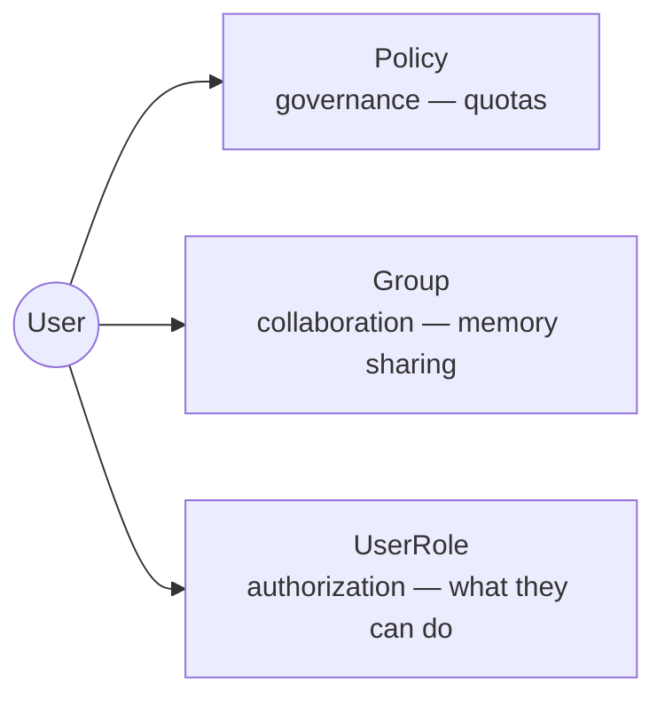
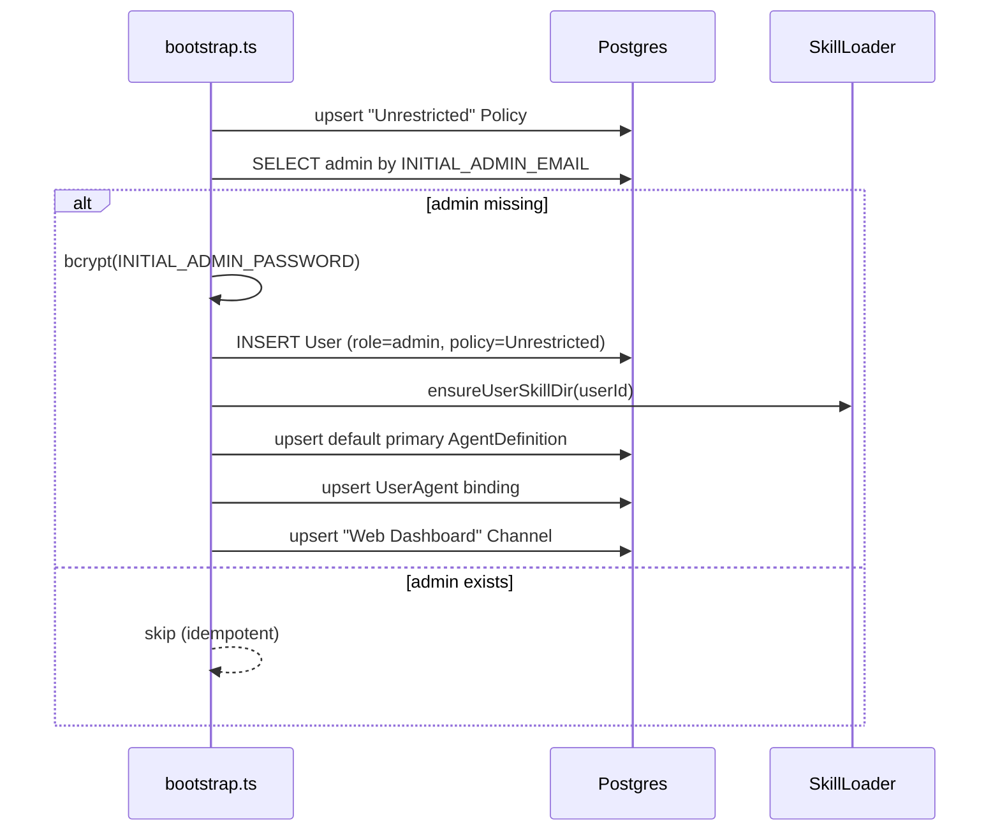
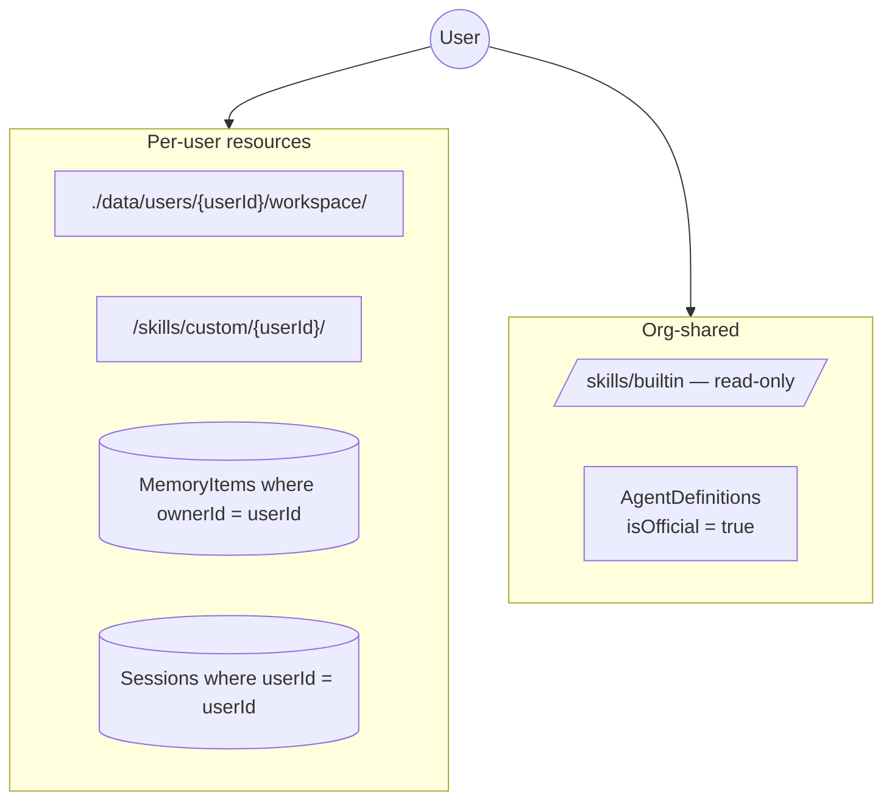
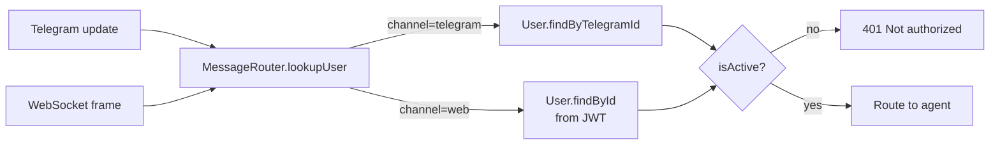
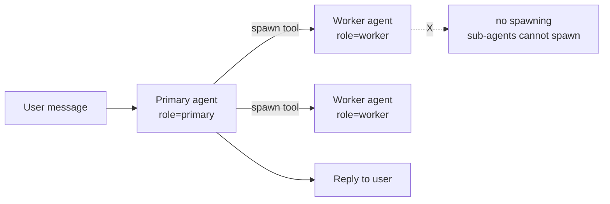
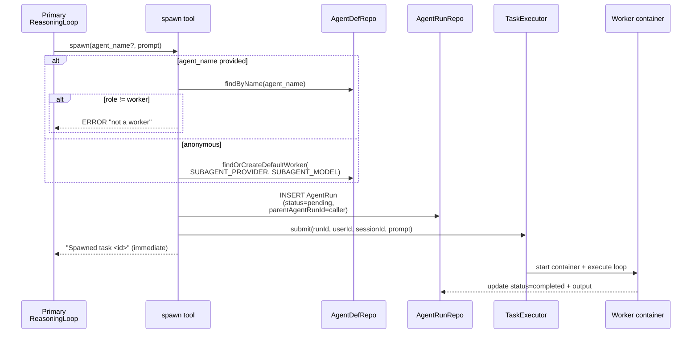
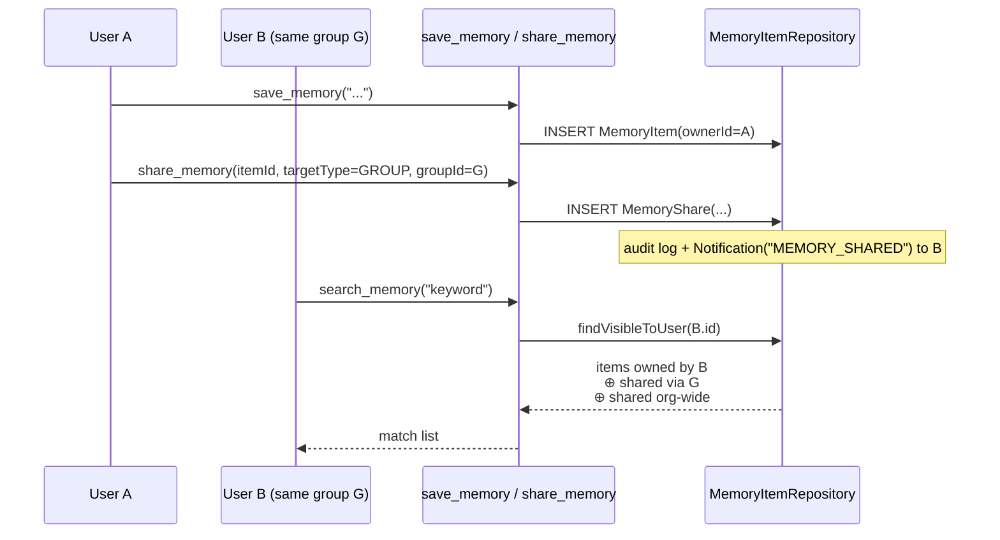
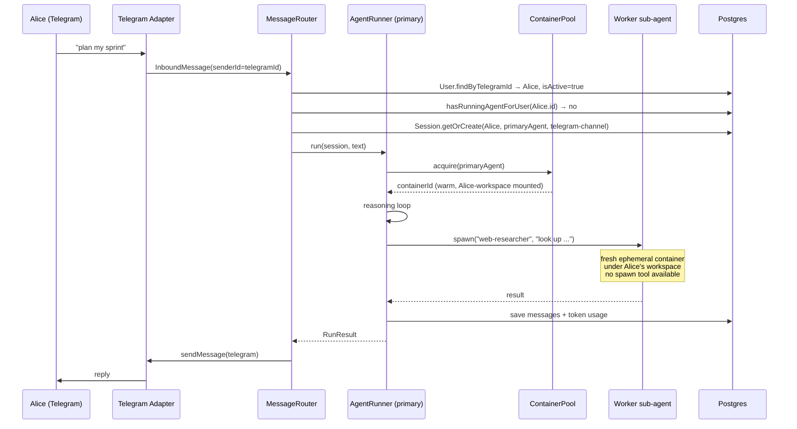

# Clawix — Multi-User Model

> How Clawix supports multiple users inside a single self-hosted organization, and how primary agents and spawned sub-agents fit into that model.
> Sections describing code that does not yet exist are marked **[pending]**.

---

## 1. Three orthogonal axes

Every user is governed along **three independent axes**. Keeping them orthogonal is deliberate — changing one does not implicitly change the others.

| Axis         | Model                   | Decides                           | Examples                                                                                |
| ------------ | ----------------------- | --------------------------------- | --------------------------------------------------------------------------------------- |
| **Policy**   | `Policy`                | Quotas, limits, allowed providers | `maxTokenBudget`, `maxAgents`, `cronEnabled`, `minCronIntervalSecs`, `allowedProviders` |
| **Group**    | `Group` + `GroupMember` | Who can see shared memory         | "engineering", "sales-asia"                                                             |
| **UserRole** | `User.role` enum        | What actions are permitted        | `admin`, `developer`, `viewer`                                                          |

A user has exactly **one Policy**, **zero-or-more Groups**, and **exactly one Role**. Changing a role never changes quotas; changing a policy never changes group visibility.

---

## 2. User lifecycle

### 2.1 Bootstrap (first admin)

`packages/api/src/bootstrap.ts` runs on API startup and is fully **idempotent** — it never deletes or overwrites existing rows.

Env vars: `INITIAL_ADMIN_EMAIL`, `INITIAL_ADMIN_PASSWORD`, `INITIAL_ADMIN_NAME` (default `Administrator`).

---

## 3. Per-user isolation

Isolation is enforced at four layers:

### 3.1 Workspace

- `WorkspaceSeederService` plants `SOUL.md`, `USER.md`, `MEMORY.md` the first time a user touches an agent, using templates from `infra/templates/`.

### 3.2 Skills

- `/skills/builtin/` — mounted **read-only** into every container (org-level system skills: `skill-creator`, `projector-creator`).
- `/skills/custom/<userId>/` — mounted read-write into that user's containers only. A user cannot see another user's custom skills because `ContextBuilder` filters to the current user's subtree.
- Quota: `Policy.maxSkills` caps how many custom skills a user can create.

### 3.3 Memory

- `MemoryItem.ownerId` = the writing user.
- `MemoryItemRepository.findVisibleToUser()` returns the union of:
  - items owned by the user,
  - items shared into groups the user belongs to (`MemoryShare.targetType = GROUP`, `isRevoked = false`),
  - items shared org-wide (`MemoryShare.targetType = ORG`, `isRevoked = false`).
- See §7 for the sharing flow.

### 3.4 Sessions

- Composite resolution key: `(userId, agentDefinitionId, channelId)`. One active session per user × agent × channel.
- Sessions carry `AgentRun` rows (each reasoning-loop invocation) and `SessionMessage` rows (persisted turns).
- Cascade-deletes with the user.

### 3.5 Channel ↔ user mapping

- **Web** — the authenticated JWT carries `userId`; the WebSocket gateway verifies the JWT on connect.
- **Telegram** — each Clawix user can claim one `telegramId`. Messages from an un-claimed Telegram id are rejected.
- **WhatsApp** — implemented via `@whiskeysockets/baileys` (Business API).
- **Slack** — **[pending]** (adapter not implemented).

---

## 4. Primary agent vs sub-agent

Clawix distinguishes **primary** agents (the one a user chats with) from **worker** agents (sub-agents that only ever run when spawned).

### 4.1 Properties

| Property                   | Primary (`role = primary`)                        | Worker (`role = worker`)                       |
| -------------------------- | ------------------------------------------------- | ---------------------------------------------- |
| Entry point                | User message from any channel                     | `spawn` tool call by a primary                 |
| Session                    | Persistent — resumed per `(user, agent, channel)` | Fresh, isolated, thrown away                   |
| Context builder loads      | History + SOUL.md + USER.md + MEMORY.md + skills  | Focused prompt only (no history, no bootstrap) |
| Container                  | Pulled from `ContainerPoolService` warm pool      | Ephemeral — `start → exec → stop`              |
| `spawn` tool available     | ✅                                                | ❌ (recursion prevented)                       |
| Counts against concurrency | ✅                                                | ✅ (same per-user running cap)                 |

`AgentDefinition.role` is a Prisma enum (`primary | worker`). Workers cannot be chatted with from a channel; primaries cannot be passed to `spawn`.

### 4.2 The `spawn` tool

Notes:

- Returns **immediately** with a task id — the primary does not block on the worker.
- The parent `AgentRunId` is recorded so the result can be correlated back.
- Anonymous spawn defaults to `SUBAGENT_PROVIDER` / `SUBAGENT_MODEL` env vars. The `default-worker` definition is created once on first use.
- Streaming sub-agent output back into the parent's context (vs polling task status) — **[pending]** in some code paths; today the simplest flow is the parent inspecting the resulting `AgentRun` row.

### 4.3 Agent ownership (`UserAgent`)

Each `(userId, agentDefinitionId)` is bound once in `UserAgent`. That row carries the per-user workspace path and the `lastSessionId` for quick resume.

| Field                         | Purpose                                    |
| ----------------------------- | ------------------------------------------ |
| `userId`, `agentDefinitionId` | Composite unique key.                      |
| `workspacePath`               | Relative path under `WORKSPACE_BASE_PATH`. |
| `lastSessionId`               | Shortcut for "continue last conversation". |

`AgentDefinition.isOfficial`:

- `true` — created by the system/admin; visible to everyone.
- `false` — user-authored (`createdById` set); scoped to that user in listings.

A single fix commit (`c9c2fbb — set isOfficial=false for user-created agents`) records that this distinction is live in code.

---

## 5. Groups and memory sharing

- `GroupMember.role` is `OWNER` or `MEMBER`. Owners can invite / remove members.
- Sharing is **reversible**: `MemoryShare.isRevoked = true` hides the item without deleting history (soft-delete for audit).
- Notifications (`Notification` model) fire on `MEMORY_SHARED`, `MEMORY_REVOKED`, `GROUP_INVITE` — delivery to channels is **[pending]** for some transports.

Agents are **not** shared through groups — each user has an explicit `UserAgent` binding. Group membership only affects memory visibility today.

---

## 6. Summary — a message from user Alice

Every step is tied back to Alice via the authenticated `User.id`: workspace path, memory visibility, per-user concurrency, policy quota, and audit log entries. When a sub-agent is spawned during this request it still runs **as Alice** — it uses Alice's workspace, counts against Alice's caps, and contributes to Alice's token budget.
