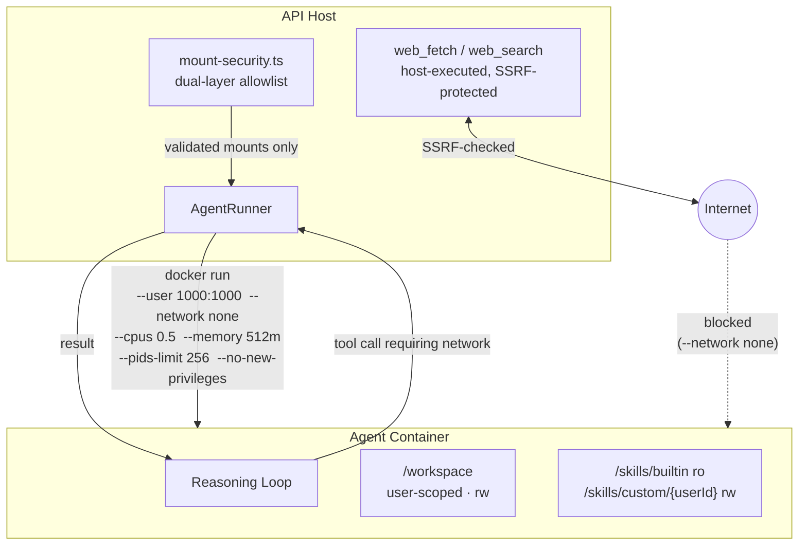

# Clawix — Security Architecture

> How Clawix protects itself and its users. Items marked **[pending]** are on the roadmap but not yet live.

Clawix runs LLM-backed agents that can read files, execute shell commands, and call external APIs. That combination demands a security posture built on three principles:

1. **Containment over correctness** — even if an agent is tricked or misbehaves, the blast radius is bounded by the sandbox.
2. **Zero-trust for agent output** — anything an LLM or tool produces is treated as potentially hostile.
3. **Audit everything that matters** — authentication events, privileged writes, and tool calls are logged and traceable.

---

## Threat model

| Threat                           | Primary control                                                                 |
| -------------------------------- | ------------------------------------------------------------------------------- |
| Unauthenticated API access       | JWT on every route; `@Public()` opt-out is explicit and reviewed                |
| Cross-user data leakage          | Ownership filters enforced at the repository layer                              |
| Credential theft from DB dump    | AES-256-GCM encryption of all provider API keys and channel secrets             |
| Arbitrary code execution on host | Agents run exclusively inside non-root Docker containers with `--network none`  |
| Host filesystem exfiltration     | Dual-layer mount allowlist blocks credential paths and enforces per-agent scope |
| SSRF / internal network scans    | IP-range validation + DNS-rebinding protection on all host-executed web tools   |
| Prompt injection via tool output | Structured role separation, output truncation, schema-validated tool calls      |
| Runaway agents or cron jobs      | Per-user concurrency caps, timeout enforcement, auto-disable circuit breaker    |
| Audit tampering                  | `AuditLog` is append-only by API contract; no update or delete routes exist     |

---

## Container isolation

Every agent invocation runs inside a dedicated Docker container. No agent code ever executes on the host. The container is torn down after the session ends or on timeout.

### Hardening flags

| Flag                  | Value                   | What it prevents                                       |
| --------------------- | ----------------------- | ------------------------------------------------------ |
| `--user`              | `1000:1000`             | Root escalation inside the container                   |
| `--network`           | `none`                  | Direct internet or LAN access from agent code          |
| `--cpus`              | `0.5` (configurable)    | CPU exhaustion / denial of service                     |
| `--memory`            | `512 MB` (configurable) | Memory exhaustion; OOM-kill on overrun                 |
| `--pids-limit`        | `256`                   | Fork-bomb attacks                                      |
| `--security-opt`      | `no-new-privileges`     | `setuid` / privilege escalation                        |
| `--read-only` + tmpfs | optional                | Rootfs writes outside `/tmp` (`noexec, nosuid, 64 MB`) |

### Network isolation

Containers have no network interface. Any agent tool that needs the internet (`web_fetch`, `web_search`) is executed on the host side — not inside the container. Each outbound request passes through SSRF protection: hostname is resolved, the resulting IP is checked against blocked ranges (RFC 1918, loopback, link-local), and the IP is pinned into the HTTP client to prevent DNS-rebinding. Responses are truncated to 10 MB and 5 redirects maximum before being returned to the model.

### Mount security

Every host path that would be bind-mounted into a container must pass two independent allowlist checks:

1. **Host-level allowlist** — an operator-managed JSON file (`$CLAWIX_MOUNT_ALLOWLIST`) that defines permitted root directories. If the file is absent, all mounts are denied.
2. **Per-agent allowlist** — `AgentDefinition.containerConfig.allowedMounts` in the database, managed via the admin API.

A path must pass both layers. Symlinks are resolved before validation so traversal tricks cannot widen either allowlist. A hardcoded blocklist always denies credential paths (`.ssh`, `.aws`, `.env`, `*.pem`, `/etc/shadow`, `/proc`, etc.) regardless of configuration.

---

## Authentication & authorization

- **Passwords** are bcrypt-hashed (12 rounds).
- **Access tokens** are short-lived JWTs (15 min). **Refresh tokens** are 32-byte random values stored in Redis with a 7-day TTL and single-use rotation — the old token is deleted when a new one is issued.
- Every request re-validates `user.isActive`; deactivating a user takes effect on their next call.
- Authorization is enforced by a three-layer guard chain: `JwtAuthGuard` → `RolesGuard` (`admin / developer / viewer`) → `PolicyThrottlerGuard` (Redis-backed, per-user rate limit).
- All secrets stored in the database (provider API keys, channel tokens) are encrypted with AES-256-GCM. They are masked in API responses and only decrypted at call time.

---

## Prompt injection defenses

Clawix does not claim to prevent prompt injection outright, but structures the pipeline so that a successful injection has bounded consequences:

- The system prompt is assembled server-side and never concatenated with user content — user messages always arrive in a separate `role: user` turn.
- Skill names, descriptions, and memory items are XML-entity-escaped before being interpolated into the system prompt.
- All LLM-issued tool calls are validated against JSON Schema before execution; unknown tools and malformed arguments are rejected.
- Tool output is truncated (default 16 KB) before being returned to the model, capping injected payload size.
- Even a successful injection still runs inside the container sandbox with the mount allowlist and no network — exfiltration requires bypassing both.
- Tool approval workflow (human confirmation for high-impact tools) — **[pending]**.

---

## Audit logging

Every mutating HTTP action (POST / PATCH / PUT / DELETE) is automatically intercepted and written to the append-only `AuditLog` table — no per-endpoint instrumentation required. Each record captures actor, action, resource, IP address, and a before/after snapshot.

Structured logs (`pino`) record every tool call, LLM invocation, and container lifecycle event with a request ID so an audit row can be correlated with the underlying trace.

---

## Roadmap

| Item                                            | Status                                                                      |
| ----------------------------------------------- | --------------------------------------------------------------------------- |
| Human-gated tool / skill approvals              | **[pending]**                                                               |
| DB-level append-only enforcement for `AuditLog` | **[pending]**                                                               |
| Key rotation automation                         | **[pending]** — manual re-encryption via `scripts/encrypt-secret.mjs` today |
| Self-service registration and password reset    | **[pending]**                                                               |
| WhatsApp channel adapter                        | Implemented                                                                 |
| Slack channel adapter                           | **[pending]**                                                               |
| Responsible-disclosure policy and contact       | **[pending]**                                                               |

---

## Operational checklist

- Generate strong `JWT_SECRET` and `PROVIDER_ENCRYPTION_KEY` (32 random bytes each) — never reuse defaults.
- Restrict the host mount allowlist to directories you are comfortable exposing to a potentially-compromised container; prefer `allowReadWrite: false`.
- Enable Docker user-namespace remapping on the host for an additional UID isolation layer.
- Do not mount the Docker socket into anything other than the API container.
- Front the API with TLS termination; HSTS is enforced but only protects HTTPS listeners.
- Back up the encryption key separately from the database — losing it makes stored secrets unrecoverable.
