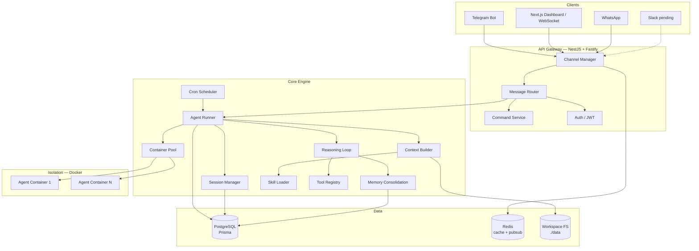
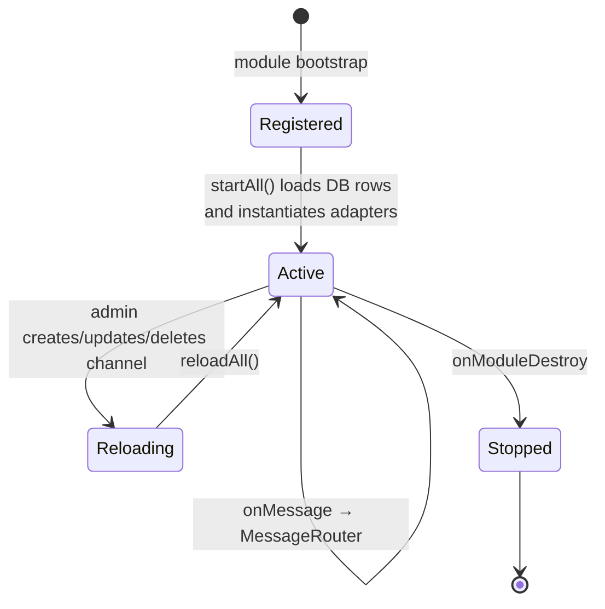
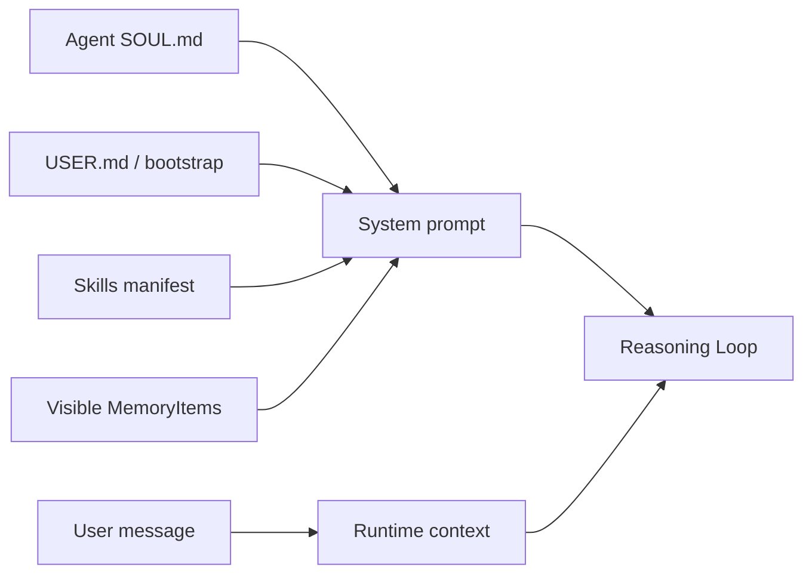
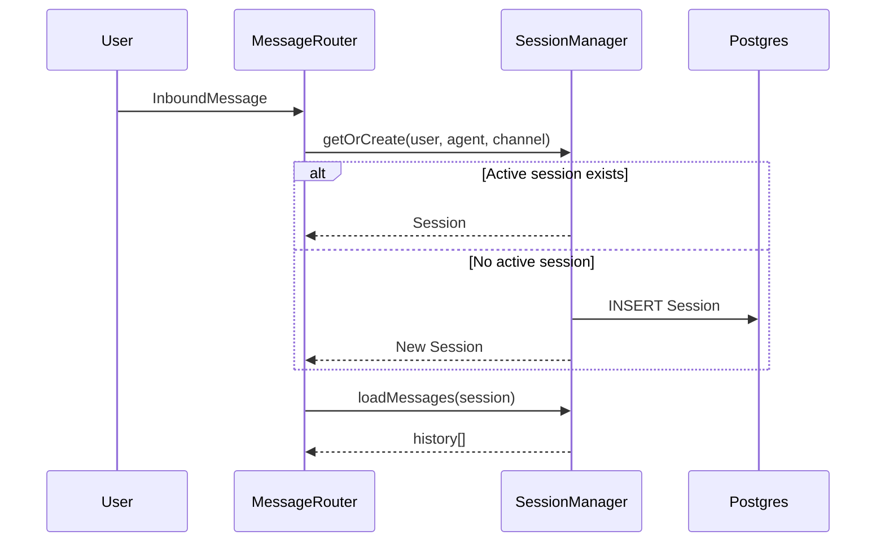
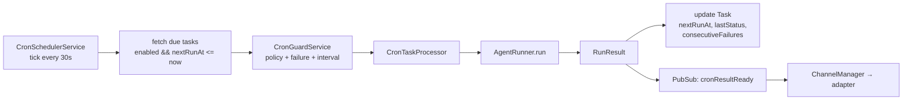
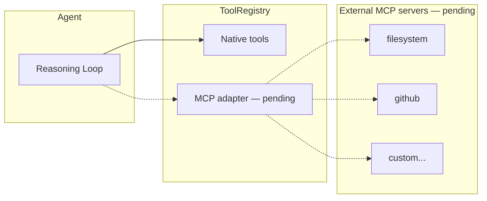
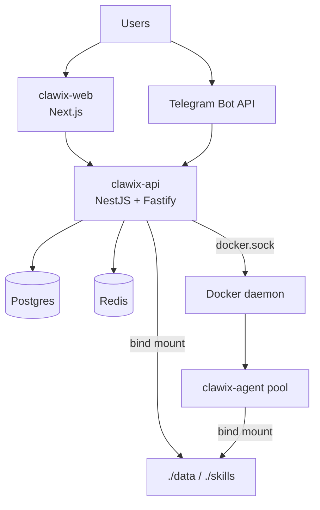

# Clawix — Technical Specification

> Open-source, self-hosted, single-org, multi-agent AI orchestration platform.
> This document reflects the state of the code at the time of writing. Sections that describe code that does not yet exist are marked **[pending]**.

---

## 1. Architecture

Clawix is a layered, security-first orchestration platform that runs LLM-backed agents inside isolated Docker containers and exposes them to users through multiple messaging channels. All model calls, tool calls, and container operations flow through a single NestJS API server so that authorization, token accounting, and auditing can be enforced in one place.

### 1.1 High-level layers



### 1.2 Architectural invariants

- **No direct LLM calls outside the engine** — all provider calls go through `packages/api/src/engine/providers/*` so token usage is counted.
- **No agent code on the host** — agents execute exclusively inside Docker sandboxes via `ContainerPoolService` / `ContainerRunner`.
- **Mount allowlist enforcement** — every container mount is validated by `mount-security.ts` (host-level + per-agent allowlist).
- **Append-only audit log** — `AuditLog` rows have no update/delete API surface.
- **Zod-validated inputs at the API boundary** — downstream code never reads raw `req.body`.

---

## 2. Architecture: Channel System

Channels are pluggable adapters that translate platform-specific events (Telegram updates, WebSocket frames, etc.) into a shared `InboundMessage` / `OutboundMessage` contract.

### 2.1 Components

| Component                       | File                                                     | Responsibility                                                                                            |
| ------------------------------- | -------------------------------------------------------- | --------------------------------------------------------------------------------------------------------- |
| `ChannelRegistry`               | `packages/api/src/channels/channel.registry.ts`          | Factory registry keyed by channel type.                                                                   |
| `ChannelManagerService`         | `packages/api/src/channels/channel-manager.service.ts`   | Lifecycle (start/stop/reload), active pool, Redis pub/sub delivery for async agent output.                |
| `MessageRouterService`          | `packages/api/src/channels/message-router.service.ts`    | Ingress routing: user lookup, command detection, concurrency guard, session resolution, agent invocation. |
| `TelegramAdapter`               | `packages/api/src/channels/telegram/telegram.adapter.ts` | `grammy`-based polling/webhook bot. MarkdownV2 formatting via `telegram.formatter.ts`.                    |
| `WebAdapter` + `WebChatGateway` | `packages/api/src/channels/web/*`                        | WebSocket gateway on `/ws/chat` with JWT auth, multi-tab support (per-user socket set).                   |
| `channel-config-crypto.ts`      | same folder                                              | AES-256-GCM encryption of per-channel secrets (e.g. `bot_token`, `signing_secret`).                       |

### 2.2 Supported channels

| Channel         | Status        | Notes                                                              |
| --------------- | ------------- | ------------------------------------------------------------------ |
| Telegram        | Implemented   | Polling (default) or webhook; user keyed by `telegramId`.          |
| Web (WebSocket) | Implemented   | JWT-authenticated WebSocket on `/ws/chat`; user keyed by `userId`. |
| WhatsApp        | Implemented   | WhatsApp Business API via `@whiskeysockets/baileys`.               |
| Slack           | **[pending]** | Enum and config-crypto stubs exist; no adapter yet.                |

### 2.3 Channel lifecycle



---

## 3. Folder Structure

```
clawix_dev/
├── packages/
│   ├── api/                  NestJS server — all orchestration logic
│   │   ├── src/
│   │   │   ├── agents/       Agent CRUD + definitions
│   │   │   ├── auth/         JWT strategy, guards, roles decorator
│   │   │   ├── channels/     Channel registry, adapters, router
│   │   │   ├── chat/         Chat REST endpoints
│   │   │   ├── commands/     Slash-command framework (/reset, /compact, /help)
│   │   │   ├── common/       Shared config (security, crypto, throttling)
│   │   │   ├── db/           Prisma repositories
│   │   │   ├── engine/       Core engine — runner, loop, tools, cron, memory
│   │   │   ├── messages/     Message persistence
│   │   │   ├── tasks/        Scheduled-task REST surface
│   │   │   ├── workspace/    Scoped workspace FS controller
│   │   │   └── ...           admin, audit, cache, health, profile, tokens, etc.
│   │   └── prisma/           schema.prisma + migrations
│   ├── web/                  Next.js 15 dashboard (React 19, Tailwind 4, shadcn/ui)
│   ├── shared/               Cross-package types, Zod schemas, providers, logger
│   ├── engine/               Reserved; engine code currently lives in api/src/engine
│   └── worker/               Reserved; background jobs run in-process in api
├── skills/
│   ├── builtin/              System skills (projector-creator, skill-creator)
│   └── custom/               User-authored skills
├── infra/
│   ├── docker/               Multi-stage Dockerfiles (api, web, agent)
│   └── templates/            SOUL.md.template, USER.md.template, projector/
├── data/                     Runtime per-user workspaces (bind-mounted into agent containers)
├── scripts/                  install.mjs, update.mjs, setup-dev.sh, encrypt-secret.mjs
├── docs/                     Architecture, implementation-plan/, specs/, policies/, drafts/
├── docker-compose.dev.yml
├── docker-compose.prod.yml
└── pnpm-workspace.yaml
```

---

## 4. Configuration

Configuration is env-driven. Values are resolved in this order: **DB-backed config** (e.g. provider API keys cached 60 s) → **env vars** → **defaults**.

### 4.1 Key environment variables

| Group      | Var                                                                                   | Purpose                                                    |
| ---------- | ------------------------------------------------------------------------------------- | ---------------------------------------------------------- |
| Database   | `DATABASE_URL`                                                                        | Postgres connection string.                                |
| Cache      | `REDIS_URL`                                                                           | Redis for sessions, rate limiting, pub/sub.                |
| Auth       | `JWT_SECRET`, `JWT_EXPIRES_IN`, `JWT_REFRESH_EXPIRES_IN`, `BCRYPT_SALT_ROUNDS`        | Access / refresh token config.                             |
| Crypto     | `PROVIDER_ENCRYPTION_KEY`                                                             | 32-byte hex; AES-256-GCM for provider & channel secrets.   |
| Providers  | `DEFAULT_PROVIDER`, `DEFAULT_LLM_MODEL`, `ANTHROPIC_API_KEY`, `OPENAI_API_KEY`        | Default LLM routing.                                       |
| Providers  | `GEMINI_API_KEY`                                                                      | Google Gemini API key.                                     |
| Providers  | `KIMI_CODE_API_KEY`                                                                   | Kimi Coding Plan API key.                                  |
| Containers | `AGENT_CONTAINER_IMAGE`, `AGENT_MAX_RETRIES`, `AGENT_TIMEOUT_SECONDS`                 | Container pool defaults.                                   |
| Workspace  | `WORKSPACE_BASE_PATH`, `WORKSPACE_HOST_BASE_PATH` (a.k.a. `CLAWIX_HOST_DATA_DIR`)     | In-container vs host paths for bind mounts.                |
| Skills     | `SKILLS_BUILTIN_DIR`, `SKILLS_CUSTOM_DIR`, `SKILLS_*_HOST_DIR`, `MAX_SKILLS_PER_USER` | Skill loader roots (container + host).                     |
| Search     | `BRAVE_API_KEY`                                                                       | Web-search tool; falls back to DuckDuckGo zero-config.     |
| Bootstrap  | `INITIAL_ADMIN_EMAIL`, `INITIAL_ADMIN_PASSWORD`                                       | Idempotent first-admin seed.                               |
| CORS       | `CORS_ALLOWED_ORIGINS`                                                                | Comma-separated allowlist (no wildcards with credentials). |

### 4.2 DB-backed config

- `ProviderConfig` — per-provider API keys (encrypted with `PROVIDER_ENCRYPTION_KEY`), cached 60 s.
- `SystemSettings` — global runtime toggles.
- `Channel.config` — JSON blob; sensitive fields encrypted selectively (`telegram.bot_token`, `slack.signing_secret`, `whatsapp.api_token`).

---

## 5. Memory System

Memory is twofold: **session compaction** (automatic summarization of long chat history) and **long-term memory items** (user-authored knowledge shared across sessions).

### 5.1 Memory items (long-term)

- Model: `MemoryItem` (`schema.prisma`) — `content JSON`, `tags String[]`, `ownerId`, timestamps.
- Visibility: **private** (owner only), **group-shared** (via `MemoryShare` + `GroupMember`), **org-shared**.
- Repository: `MemoryItemRepository.findVisibleToUser()`, `search(query, tags, maxResults)`.
- Tools exposed to the agent (`packages/api/src/engine/tools/memory.ts`):
  - `save_memory` — create/update (≤ 2 000 chars, ≤ 10 tags @ 50 chars).
  - `search_memory` — case-insensitive substring + tag-AND filter, ≤ 20 results, across private/group/org.
  - `share_memory` — idempotent share to group or org, audit-logged.
  - `list_groups` — enumerate memberships.

### 5.2 Session compaction (short-term)

- Service: `MemoryConsolidationService` — triggers when session token usage exceeds a threshold (default 65 536 tokens).
- Produces an LLM summary (GPT-4o-mini) inserted as a synthetic `system` message prefixed `[MEMORY SUMMARY]`.
- Falls back to raw archival after 3 consecutive LLM failures.
- State thresholds: **none** (<75 %), **approaching** (75–90 %), **critical** (≥90 %).

### 5.3 Context injection

`ContextBuilderService` (`engine/context-builder.service.ts`) assembles the system prompt each turn from:

1. Agent identity (SOUL.md template).
2. Workspace hints + bootstrap files (USER.md).
3. Loaded skills metadata (progressive — name + description only until invoked).
4. Scheduling / cron capabilities.
5. Memory items, newest-first, capped at ~2 000 estimated tokens.
6. Runtime context prepended to the user message: `Current Time`, `Channel`, `Chat ID`, `User`.



---

## 6. Session Management

- Model: `Session` (`schema.prisma`) — `userId`, `agentDefinitionId`, `channelId?`, `isActive`, `topic`, `lastConsolidatedAt`.
- Resolution key: composite `(userId, agentDefinitionId, channelId)` → one active session per user × agent × channel.
- Service: `SessionManagerService` (`engine/session-manager.service.ts`).
  - `getOrCreate()` — resume or create; validates ownership & agent binding.
  - `loadMessages()` / `saveMessages()` — persisted via `SessionMessage` with monotonic `ordering` and soft-delete `archivedAt`.
  - `compact()` — soft-archive old non-system messages (semantic consolidation lives in `MemoryConsolidationService`).
  - `deactivate()` — ends the session, forcing a fresh start on next message.



---

## 7. Message Flow

End-to-end path of a single user message:

```mermaid
sequenceDiagram
    autonumber
    participant Ch as Channel Adapter<br/>(Telegram / Web)
    participant CM as ChannelManager
    participant MR as MessageRouter
    participant Cmd as CommandService
    participant SM as SessionManager
    participant AR as AgentRunner
    participant RL as ReasoningLoop
    participant Tools as ToolRegistry
    participant Box as Agent Container
    participant LLM as LLM Provider

    Ch->>CM: InboundMessage
    CM->>MR: route(msg, adapter)
    MR->>MR: lookup user (telegramId / userId)
    MR->>MR: authz check (user active)
    alt is slash command
        MR->>Cmd: execute(text, ctx)
        Cmd-->>MR: text / forwardToAgent
        MR-->>Ch: sendMessage
    else regular message
        MR->>MR: concurrency guard (one run/user)
        MR->>SM: getOrCreate + loadMessages
        MR->>AR: run(session, text)
        AR->>Box: acquire warm container
        loop until terminal
            AR->>RL: step
            RL->>LLM: complete(messages, tools)
            LLM-->>RL: assistant / tool_call
            opt tool_call
                RL->>Tools: invoke(name, args)
                Tools->>Box: exec (shell/file/spawn/...)
                Tools-->>RL: result
            end
        end
        AR-->>MR: RunResult(output, tokens)
        MR->>Ch: sendMessage(output)
    end
```

Key guards along the path:

- **Authorization** — user must be active; channel-keyed lookup.
- **Concurrency** — at most one running agent per user (rejects otherwise).
- **Typing indicators** — optional capability reported by the adapter.
- **Async re-invocation** — agents can emit additional output via Redis pub/sub, which `ChannelManagerService` delivers back through the adapter.

---

## 8. Commands

Slash commands are handled before the agent ever sees the message.

- Registry: `CommandService` (`packages/api/src/commands/command.service.ts`) — maps command name → `SessionCommand`.
- Detection: `isCommand(text)` (registered name) and `isSlashPrefixed(text)` (unknown `/foo` → explicit error).
- Context: `{ userId, sessionId, channelId, senderId, agentDefinitionId, args? }`.
- Result: `{ text, forwardToAgent? }` — a command can optionally re-inject into the agent.

### 8.1 Built-in commands

| Command    | File                 | Effect                                                                                                                                                             |
| ---------- | -------------------- | ------------------------------------------------------------------------------------------------------------------------------------------------------------------ |
| `/reset`   | `reset.command.ts`   | Deactivates the current session so the next message starts fresh. Requires the session to have messages.                                                           |
| `/compact` | `compact.command.ts` | Runs `MemoryConsolidationService` with `force: true`; reports before/after token count, rounds, and number of messages archived. Requires ≥ 4 non-system messages. |
| `/help`    | `help.command.ts`    | Lists all registered commands (late-bound via getter to avoid circular DI).                                                                                        |

---

## 9. Scheduled Tasks

Cron-style tasks let agents schedule their own future work (e.g. "remind me at 9 am every weekday").

### 9.1 Data model

- `Task` — `name`, `prompt`, `schedule JSON`, `agentDefinitionId`, `createdByUserId`, `channelId?`, `enabled`, `nextRunAt`, `lastRunAt`, `lastStatus`, `consecutiveFailures`, `disabledReason`, `timeoutMs`. Indexed on `(enabled, nextRunAt)` for the poller.
- `TaskRun` — history: `status`, `output`, `error`, `tokenUsage JSON`, `startedAt`, `completedAt`, `durationMs`.

### 9.2 Schedule formats

- `{ type: "every", interval: "1h" }` — `\d+(s|m|h|d)` → seconds.
- `{ type: "cron", expression: "0 9 * * MON-FRI", tz: "America/New_York" }` — parsed with `cron-parser`, IANA tz validated.
- `{ type: "at", time: "2026-12-25T09:00:00Z" }` — one-shot; auto-disabled after execution.

### 9.3 Runtime



- **Concurrency** — global default 20 runs, per-user default 2.
- **Timeout** — effective = `min(task.timeoutMs, policy.maxTimeoutMs, 900 s)`.
- **Auto-disable** — one-time tasks post-execution; recurring tasks after 3 consecutive failures.
- **Startup recovery** — `recoverOrphanedRuns()` marks timed-out runs as failed on API boot.
- **Agent-facing tool** — `cron` tool with `list / create / remove` actions (`engine/tools/cron.ts`); creation/removal is blocked inside a cron execution to avoid recursive scheduling.

---

## 10. Prompt Caching

Anthropic prompt caching with frozen-snapshot system prompts (Stage 2). The system prompt is cached once and reused across turns within a session, reducing token costs. Implemented via `@anthropic-ai/sdk` built-in caching with `cacheControl: { type: 'ephemeral' }` breakpoints.

---

## 11. Streaming Multi-Message Delivery

Per-agent streaming delivery flag. When enabled, intermediate agent messages (tool calls, progress updates) are streamed to the client in real-time via WebSocket and channel adapters. Implemented in #63.

---

## 12. MCP Servers — **[pending]**

MCP (Model Context Protocol) is **not yet integrated**. The Anthropic SDK shipped with the repo (`@anthropic-ai/sdk`) includes MCP helpers, but no Clawix code imports them and there is no MCP server registry, config table, or tool adapter.

Tools today are internal TypeScript modules registered against a JSON-Schema-validated `ToolRegistry` in `packages/api/src/engine/tool-registry.ts` (`shell`, `file-io`, `web` fetch/search, `memory`, `spawn`, `cron`).

**Planned shape (not yet implemented):**



Open design questions: per-user vs per-org server configs, credential storage (reuse `PROVIDER_ENCRYPTION_KEY`?), sandboxing of stdio servers, approval workflow for tool invocations.

---

## 13. Deployment

### 13.1 Development (`docker-compose.dev.yml`)

- `postgres` — `postgres:16-alpine` on host port `5433`.
- `redis` — `redis:7-alpine`, appendonly + LRU, 256 MB cap.
- `api-server` — `node:22-slim` with source bind-mounts for hot-reload; runs `pnpm` via corepack. Mounts `/var/run/docker.sock` so the API can spawn agent containers. Bind-mounts `./data`, `./skills`, `./infra/templates`.
- `web` — Next.js dev server (see compose file).

### 13.2 Production (`docker-compose.prod.yml`)

- Multi-stage images: `clawix-api:latest` (Dockerfile in `infra/docker/api/`), `clawix-web:latest`, `clawix-agent:latest`.
- API stage 2: `node:22-slim` + `docker.io` + `openssl`; Prisma CLI global; `entrypoint.sh` runs migrations; health check `GET /health` with 60 s start period.
- Redis cap raised to 512 MB; persistent volumes for Postgres and Redis.
- Required secrets: `POSTGRES_USER`, `POSTGRES_PASSWORD`, `JWT_SECRET`, `PROVIDER_ENCRYPTION_KEY`, `CLAWIX_HOST_DATA_DIR`, `CLAWIX_HOST_SKILLS_DIR`.

### 13.3 Topology



- **K8s** — manifests directory referenced in the implementation plan but not present in `infra/` at the time of writing. **[pending]**
- **Installer** — `install.sh` + `scripts/install.mjs` / `update.mjs` orchestrate local bring-up.

---

## 14. Security Considerations

### 14.1 Authentication & Authorization

- JWT access + refresh tokens; refresh tokens tracked in Redis with TTL.
- Bcrypt password hashing (12 rounds).
- `JwtAuthGuard` + `RolesGuard` + `@Roles()` decorator for RBAC (Admin / User / Guest).
- Policy-throttled endpoints via `policy-throttler.guard.ts` (Redis-backed).

### 14.2 Container isolation

- `ContainerPoolService` warms containers per primary agent; `ContainerRunner` wraps `docker` CLI.
- Hardening defaults: non-root UID 1000, `--network none`, PID limit 256, `no-new-privileges`, optional read-only rootfs + tmpfs, CPU 0.5 / mem 512 MB, 10 s graceful stop.
- Spawn tool launches worker sub-agents in fresh containers.

### 14.3 Mount security (`engine/mount-security.ts`)

- **Host-level allowlist** — JSON of allowed roots + blocked patterns.
- **Per-agent allowlist** — additional DB-backed restriction.
- **Default-blocked** — `.ssh`, `.aws`, `.docker`, `.kube`, `*.pem`, `*.key`, `/etc/passwd`, `/proc`, `/sys`, credentials files.
- Symlink resolution + glob match before every mount.

### 14.4 Secret handling

- `common/crypto.ts` — AES-256-GCM utilities keyed off `PROVIDER_ENCRYPTION_KEY`.
- `channels/channel-config-crypto.ts` — selective encryption of channel secrets; masked in admin API responses.
- `ProviderConfigRepository` — encrypted API keys with 60 s in-memory cache.
- `scripts/encrypt-secret.mjs` — operator helper.

### 14.5 HTTP hardening

- Helmet: strict CSP in prod (`default-src 'none'`), HSTS with 1 y + preload, COEP on in prod.
- CORS: explicit allowlist (no wildcards with credentials).
- All API inputs validated with Zod schemas (`packages/shared/src/schemas`).

### 14.6 Observability & audit

- `common/audit-log.interceptor.ts` writes `AuditLog` rows for sensitive actions; rows are append-only.
- `pino` + `pino-http` structured logs; `prom-client` metrics. Grafana / Loki dashboards **[pending]**.
- `TokenCounterService` logs per-call token usage; budgets enforced via user policy.

### 14.7 Known gaps / pending

- Slack adapter.
- MCP server integration (§12).
- Kubernetes manifests under `infra/k8s/`.
- `packages/engine` and `packages/worker` are reserved but empty; engine code currently lives inside `packages/api/src/engine`.
- Grafana / Loki dashboards and alerting wiring.
